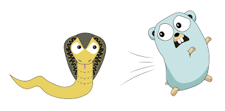

<p align="center">
  
</p>

<h1 align="center">
Go Cobra
</h1>

Building a **Dispatching Server** using _Golang_ programming language
and Golang _Cobra_ package with _tls_ license and _Sqlite_ database. The
main idea of this project is to learn _Cobra_ package and working
with _tls_ license.

In this application you can create a task then you can run it
or change it or delete it. You can also see the list of the tasks
and their status.

## What do you learn from this project?
- Golang Cobra
- TLS certification
- Sqlite

## What is Cobra?
Cobra is a powerful library and tool in Golang that is used to
create CLI (Command-Line Interface) applications. 
Cobra does this by providing tools that automate
the process and provide key abstractions that increase
developer productivity.

Read more about [Cobra](https://cobra.dev/).

List of project commands:
- ```serve```: starting dispatching server
- ```migrate```: migrating database
- ```crypto```: generate certification files

## TLS certification
Transport Layer Security (TLS) 
certificates—most commonly known as SSL, 
or digital certificates—are the foundation 
of a safe and secure internet. 

TLS/SSL certificates secure internet 
connections by encrypting data sent between 
your browser, the website you’re visiting, 
and the website server. 
They ensure that data is transmitted privately 
and without modifications, loss or theft.

Read more about [TLS](https://www.digicert.com/tls-ssl/tls-ssl-certificates#:~:text=Transport%20Layer%20Security%20(TLS)%20certificates,visiting%2C%20and%20the%20website%20server.).

## How to use project?
Clone the repository and enter into main directory.

### TLS files
You can create new TLS files:
```shell
go run main.go crypto
```

### Database migration
To create a SQLite database:
```shell
go run main.go migrate
```

### Dispatching server
Start server:
```shell
go run main.go serve
```

- `/tasks/{page?}` GET
  - page argument is optional 
  - returns a list of tasks
- `/run` POST
  - run a task command
- `/tasks` POST 
  - creating a new task command
- `/task/{id}` DELETE
  - remove an existing task
- `/task/{id}` GET
  - returns a task status
- `/task/{id}` PUT
  - updates an existing task